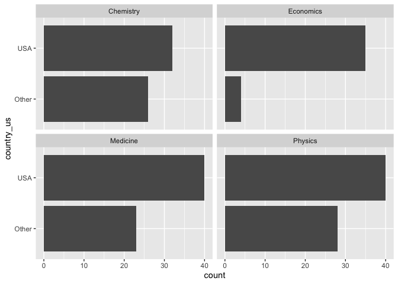

Lab 03 - Nobel laureates
================
Olivia Zhang
02/09/2025

### Load packages and data

``` r
library(tidyverse) 
```

``` r
nobel <- read_csv("data/nobel.csv")
```

## Exercises

### Exercise 1

Take a look at the dataset.

``` r
glimpse(nobel)
```

    ## Rows: 935
    ## Columns: 26
    ## $ id                    <dbl> 1, 2, 3, 4, 5, 6, 6, 8, 9, 10, 11, 12, 13, 14, 1…
    ## $ firstname             <chr> "Wilhelm Conrad", "Hendrik A.", "Pieter", "Henri…
    ## $ surname               <chr> "Röntgen", "Lorentz", "Zeeman", "Becquerel", "Cu…
    ## $ year                  <dbl> 1901, 1902, 1902, 1903, 1903, 1903, 1911, 1904, …
    ## $ category              <chr> "Physics", "Physics", "Physics", "Physics", "Phy…
    ## $ affiliation           <chr> "Munich University", "Leiden University", "Amste…
    ## $ city                  <chr> "Munich", "Leiden", "Amsterdam", "Paris", "Paris…
    ## $ country               <chr> "Germany", "Netherlands", "Netherlands", "France…
    ## $ born_date             <date> 1845-03-27, 1853-07-18, 1865-05-25, 1852-12-15,…
    ## $ died_date             <date> 1923-02-10, 1928-02-04, 1943-10-09, 1908-08-25,…
    ## $ gender                <chr> "male", "male", "male", "male", "male", "female"…
    ## $ born_city             <chr> "Remscheid", "Arnhem", "Zonnemaire", "Paris", "P…
    ## $ born_country          <chr> "Germany", "Netherlands", "Netherlands", "France…
    ## $ born_country_code     <chr> "DE", "NL", "NL", "FR", "FR", "PL", "PL", "GB", …
    ## $ died_city             <chr> "Munich", NA, "Amsterdam", NA, "Paris", "Sallanc…
    ## $ died_country          <chr> "Germany", "Netherlands", "Netherlands", "France…
    ## $ died_country_code     <chr> "DE", "NL", "NL", "FR", "FR", "FR", "FR", "GB", …
    ## $ overall_motivation    <chr> NA, NA, NA, NA, NA, NA, NA, NA, NA, NA, NA, NA, …
    ## $ share                 <dbl> 1, 2, 2, 2, 4, 4, 1, 1, 1, 1, 1, 1, 2, 2, 1, 1, …
    ## $ motivation            <chr> "\"in recognition of the extraordinary services …
    ## $ born_country_original <chr> "Prussia (now Germany)", "the Netherlands", "the…
    ## $ born_city_original    <chr> "Lennep (now Remscheid)", "Arnhem", "Zonnemaire"…
    ## $ died_country_original <chr> "Germany", "the Netherlands", "the Netherlands",…
    ## $ died_city_original    <chr> "Munich", NA, "Amsterdam", NA, "Paris", "Sallanc…
    ## $ city_original         <chr> "Munich", "Leiden", "Amsterdam", "Paris", "Paris…
    ## $ country_original      <chr> "Germany", "the Netherlands", "the Netherlands",…

935 observations and 26 variables are in the dataset. Each row
represents a noble prize winner.

### Exercise 2

Filter out the living noble prize winner:

``` r
nobel_living <- filter(nobel, is.na(died_date),
                       !is.na(country),
                       gender != "org")
nobel_living
```

    ## # A tibble: 228 × 26
    ##       id firstname   surname  year category affiliation city  country born_date 
    ##    <dbl> <chr>       <chr>   <dbl> <chr>    <chr>       <chr> <chr>   <date>    
    ##  1    68 Chen Ning   Yang     1957 Physics  Institute … Prin… USA     1922-09-22
    ##  2    69 Tsung-Dao   Lee      1957 Physics  Columbia U… New … USA     1926-11-24
    ##  3    95 Leon N.     Cooper   1972 Physics  Brown Univ… Prov… USA     1930-02-28
    ##  4    97 Leo         Esaki    1973 Physics  IBM Thomas… York… USA     1925-03-12
    ##  5    98 Ivar        Giaever  1973 Physics  General El… Sche… USA     1929-04-05
    ##  6    99 Brian D.    Joseph…  1973 Physics  University… Camb… United… 1940-01-04
    ##  7   101 Antony      Hewish   1974 Physics  University… Camb… United… 1924-05-11
    ##  8   103 Ben R.      Mottel…  1975 Physics  Nordita     Cope… Denmark 1926-07-09
    ##  9   106 Samuel C.C. Ting     1976 Physics  Massachuse… Camb… USA     1936-01-27
    ## 10   107 Philip W.   Anders…  1977 Physics  Bell Telep… Murr… USA     1923-12-13
    ## # ℹ 218 more rows
    ## # ℹ 17 more variables: died_date <date>, gender <chr>, born_city <chr>,
    ## #   born_country <chr>, born_country_code <chr>, died_city <chr>,
    ## #   died_country <chr>, died_country_code <chr>, overall_motivation <chr>,
    ## #   share <dbl>, motivation <chr>, born_country_original <chr>,
    ## #   born_city_original <chr>, died_country_original <chr>,
    ## #   died_city_original <chr>, city_original <chr>, country_original <chr>

Now we are left with only 228 observations.

Create a new variable country_us (laureates won the prize in US):

``` r
nobel_living <- nobel_living %>%
  mutate(
    country_us = if_else(country == "USA", "USA", "Other")
  )
```

Filter out the four categories (Physics, Medicine, Chemistry,
Economics):

``` r
nobel_living_science <- nobel_living %>%
  filter(category %in% c("Physics", "Medicine", "Chemistry", "Economics"))
```

### Exercise 3

Create a bar plot of US and Other laureates for the four categories:

``` r
ggplot(nobel_living_science, aes(x =country_us)) +
  geom_bar() +
  facet_wrap(~ category, ncol = 2) +
  coord_flip()
```

<!-- -->

From the bar plot, you can see that across all categories, there are
more laureates from the USA than from the sum of all other countries,
which means that USA is the main country for noble laureates.

### Exercise 4

Create a new variable born_country to categorize the laureates into US
born or Other born.

``` r
nobel_living_science <- nobel_living_science %>%
  mutate(
    born_country_us = if_else(born_country == "USA", "USA", "Other")
  )

us_born_winners <- nobel_living_science %>%
  filter(born_country_us == "USA") %>%
  nrow()
```

105 of the winners were born in the US.

### Exercise 5

Create a bar plot depicting the born countries of the US and Other
laureates.

``` r
ggplot(nobel_living_science, aes(x = country_us, 
                                 fill = born_country_us)) +
  geom_bar() +
  facet_wrap(~ category, ncol = 2) +
  coord_flip()
```

<!-- -->

The graph supports Buzzfeed’s claim that a substantial number of the US
noble prize winners are immigrants. However, there are also a bunch of
US born winners, especially for the economics.

### Exercise 6

Take a look at the born countries of the Other laureates.

``` r
nobel_living_science %>%
  filter(country_us == "USA", born_country_us == "Other") %>%
  count(born_country) %>%
  arrange(desc(n))
```

    ## # A tibble: 21 × 2
    ##    born_country       n
    ##    <chr>          <int>
    ##  1 Germany            7
    ##  2 United Kingdom     7
    ##  3 China              5
    ##  4 Canada             4
    ##  5 Japan              3
    ##  6 Australia          2
    ##  7 Israel             2
    ##  8 Norway             2
    ##  9 Austria            1
    ## 10 Finland            1
    ## # ℹ 11 more rows

Germany is the most common born country for US immgirant noble prize
winner, not a surprise given the Nazi situation.
